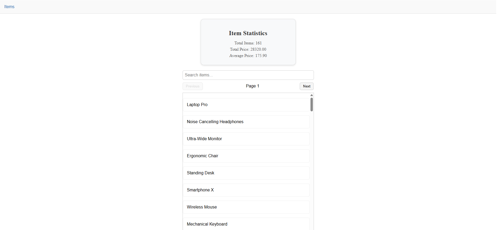

I've refactored most of the code to use services and simplified its usage.

For the stats service, I implemented a cache that updates the sum and count whenever new values are added.
I also experimented with a variant that recomputes the cache every 60 seconds.

I added validation for the API items as well.

On the frontend, I used React Window. I implemented a signal to stop requests and added polling for item stats.

Additionally, I added pagination using the skip/take method and a simple search functionality—nothing fancy.

I hope I’ve fixed the memory leak.

I also added some service and data context. I’m not very familiar with React, so I relied on Google and the docs for most of it.

Lastly, I wrote some basic tests just to get a feel for things.